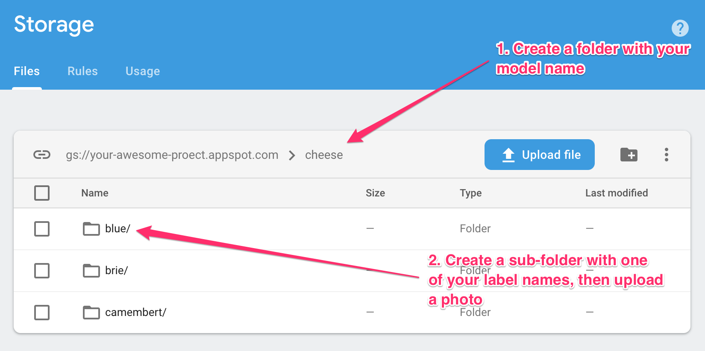
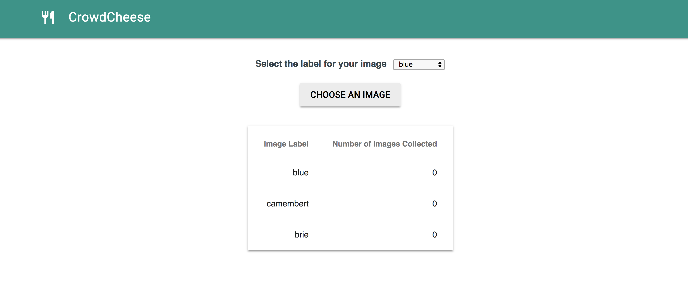

**This is not an official Google product**

# Demo: Crowdsourcing AutoML training data

This demo shows how you can build an ML pipeline that gathers labeled, crowdsourced training data, uploads it to an AutoML dataset, and then trains a model.

## Pre-requisites

* You've enabled the AutoML API in your Cloud project and created an empty AutoML dataset
* You've created a project in the Firebase console and associated it with the same project where you've created an empty AutoML model. Using the [Firebase CLI](https://firebase.google.com/docs/cli/), make sure to initialize your project with the Firebase Database, Functions, Hosting, and Storage

## Configuring the functions for your model

There are 2 separate functions in this project:

* `uploadToVcmBucket`: this copies the photo uploaded to Firebase storage to the bucket for AutoML (your project name + `-vcm`)
* `checkNumImages`: this checks how many images you have for each label in your dataset, and kicks off training if you've got enough. Currently the function looks for 10 or more for each label, but you can change this by changing the `img_threshold` variable at the top of the file. To set the model to re-train periodically, you can modify the function directly.

To configure the functions for your own project, first replace the 3 placeholder strings at the top of `functions/index.js` with info for your own project and AutoML dataset:

```javascript
const project_name = 'YOUR_PROJECT_NAME';
const project_region = 'YOUR_PROJECT_REGION';
const dataset_id = 'YOUR_AUTOML_DATASET_ID';
```
Then change the `bucket_prefix` and `labels` variables to correspond with the model you're building. This example uses cheese :)

```javascript
const bucket_prefix = 'cheese';
const labels = ['blue', 'camembert', 'brie'];
```

## Deploying the functions

From within the `functions/` directory, run `npm install` to install the Node packages listed in `functions/package.json`. The `functions/index.js` file includes the functions code to call the custom AutoML model. 

Now you're ready to deploy the functions. From the root directory of this project, run the command:

```bash
firebase deploy --only functions
```

Confirm things are working by uploading a photo to your bucket in the Firebase console. You'll need to manually create buckets with your model and label names if you'd like to test your functions before running the frontend:



Then upload 10 images for each label to confirm your CSV is created and the model starts training. If this works you should see a CSV file in the AutoML Cloud Storage bucket (name ends in `-vcm`). When you check your AutoML dataset, you should see the images uploaded and model training in progress.

## Setting up the frontend

The frontend code for this app is all in the `public/` directory and uses good old jQuery :) In `public/main.js`, update the variables at the top to include your model name and labels. This will populate a dropdown list so the user can select the label for the photo they upload.

First, try it out by serving the frontend locally. Run `firebase serve` from the root directory of this project, navigate to `localhost:5000`, and you should see this:



Try uploading an image and confirm it is added to your AutoML bucket. If the frontend is working correctly you're ready to deploy it. Run the command:

```bash
firebase deploy --only hosting
```

Now your app should be deployed to a firebaseapp.com domain, woohoo!